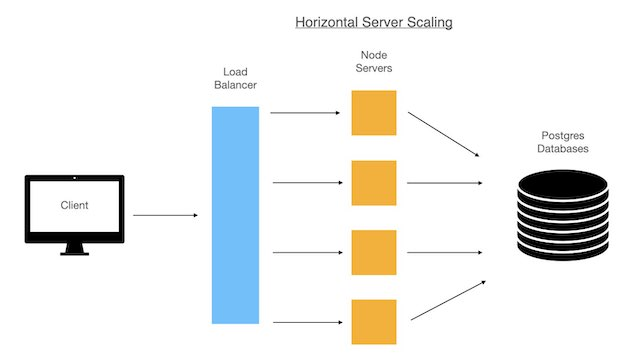
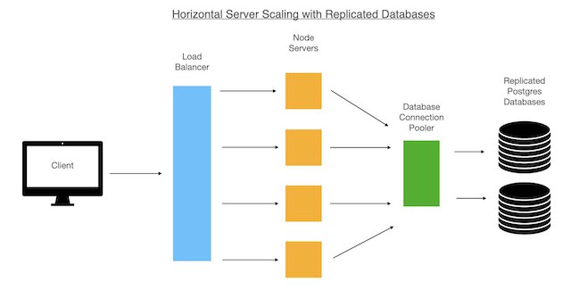
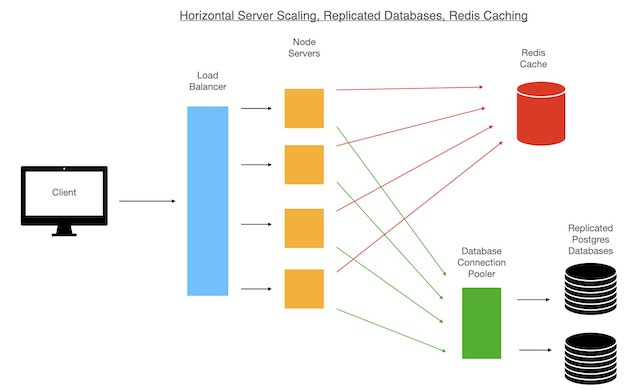

# eBay Product Page Clone

> Inherited Microservice legacy code with the goal of making it scale for real world usage and data.

## Related Projects
Other Microsevice and Proxy Repos:
  - https://github.com/rpt16-sdc-thecyclone/alexSDC
  - https://github.com/rpt16-sdc-thecyclone/albert-sdc
  - https://github.com/rpt16-sdc-thecyclone/troy-proxy

## Table of Contents

1. [General Information](#general_information)
1. [Technologies](#technologies)
1. [Requirements](#requirements)
1. [Development](#development)
1. [Installing Dependencies and Usage](#installing_dependencies_and_usage)

## General Information

I chose to refactor the service to use PostgreSQL, and remove callbacks in favor of async/await promises, for readability and performance reasons. Built a data generation script to generate the 1 to 1 data for product names, and many to 1 data for images. Total dummy data size is about 12.21 GB covering 60 million rows in 2 tables in PostgreSQL. Data generation writes all data to CSV files in about 2 min. Seeding script populates tables from CSV files. Current seeding times are 13 min.

This required first optimizing the database with indexes to reduce query times. I next explored 3 optimizations for the system as described and diagramed below.

I first horizontally scaled the node servers. Using AWS AIM images and Templates to automate adding new servers made it relatively quick to scale the servers to a point where new servers were not adding a benefit to response times. I hit this threshold between 3 and 4 servers.



The second optimization was to create a replica of my PostgreSQL database. This would not be helpful if the database was doing lots of reads and writes, which would have needed sharding and replication, but since this system was doing mostly reads it made sense to spread out those reads over multiple databases. This scaled system with everything running on EC2 micros was able to handle 2500 RPS looking in last 80% of the data set with an average response times of 75ms.



The last optimization was adding shared caching to the system with Redis. This had benefits only for specific tests scenarios. When the targeted data range was large Redis didn’t provide much help, as it was rare for data to have been cached. When the data range was reduced and the cache was warmed up response times didn’t change drastically, but through put increased.



## Technologies
Application was created with:
* Javascript
* Nodejs
* React
* Styled Components
* Webpack
* Grunt
* Express
* MySQL
* Knex

Additional Databases:
* PostgreSQL
* CassandraDB

Deployment on AWS:
* AWS EC2
* AWS Load balancer
* AWS S3 bucket for images
* Docker

System Testing:
* laoder.io
* New Relic
* JMeter

## Requirements

An `nvmrc` file is included if using [nvm](https://github.com/creationix/nvm).

- Node 6.13.0
- Local install of PostgreSQL

## Development
> Minor things that I would like to come back and work on:
* Issue with using Postgres COPY command in knex seed files
  > Addressed this issue in Sept 2020. Knex seeding was running slow, mostly due to the time it took to truncate a table with millions of rows and foreign key restraints. Adjusted how the old data was removed from the tables made seeding with Knex a viable option. However, Knex seeding still takes about 20% longer than running the same SQL commands with a postgres driver and no ORM.
* Find a way to get seeding times under 10 min
  > Addressed this issue in Sept 2020. Times were greatly reduced, but have not hit the 10 min mark yet. Refactroing reduced data creation time from around 10 min to 2 min 30 seconds. Seeding times were reduced from around 23 min to 13 min.

> Major things that I would like to come back and work on:
* Finish server refactor for Cassandra: Remove knex and use Cassandra driver, refactor Models for new database
* Work on test suite for server

### Installing Dependencies

From within the root directory:

```sh
npm install
```
Seed the Postgress Database:
```
npm run seedDB
npm run dataProd
npm run dataImg
npm run seed
```
Build webpack bundle
```
npm run build
```
Start the server
```
npm start
```

Add the query parameter prod_id set to an product number (prod_id=1), in the URL to get app to render

